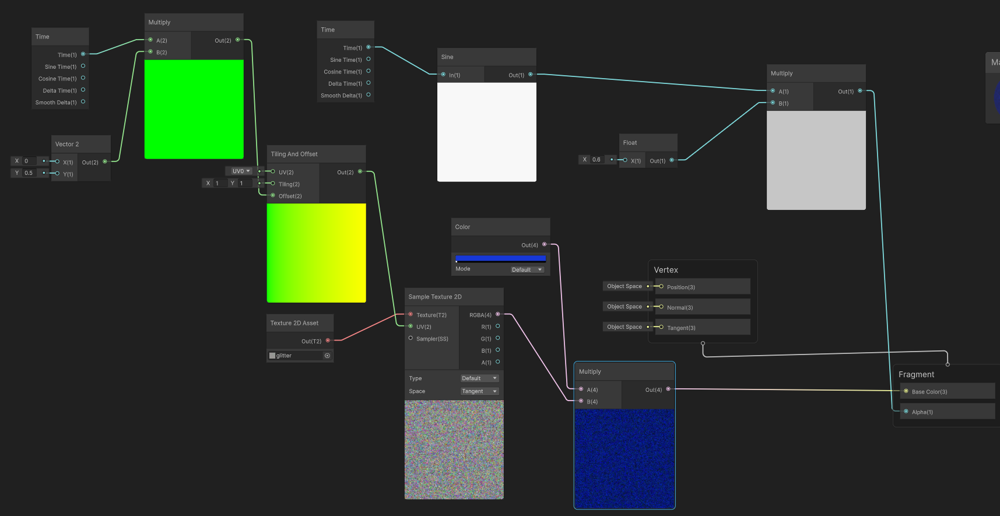
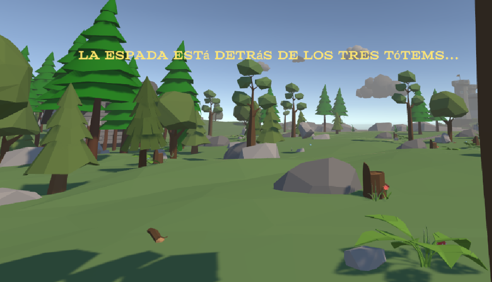
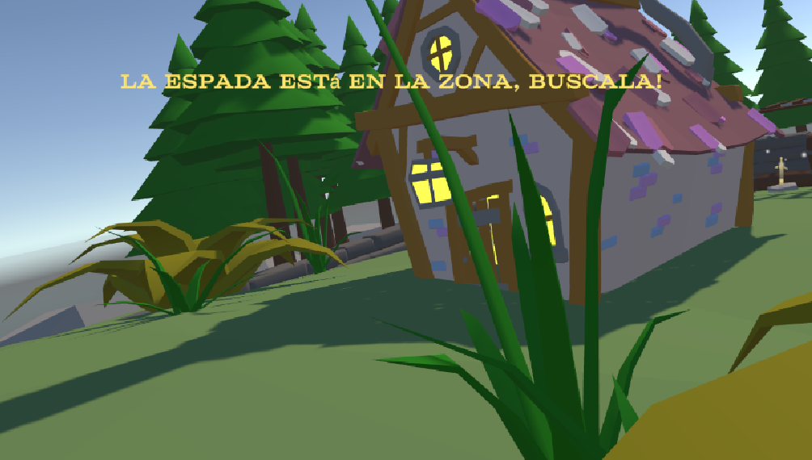
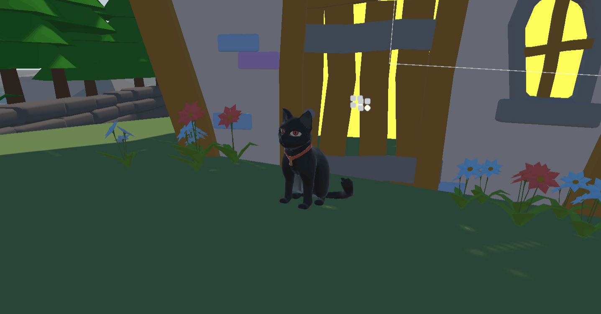
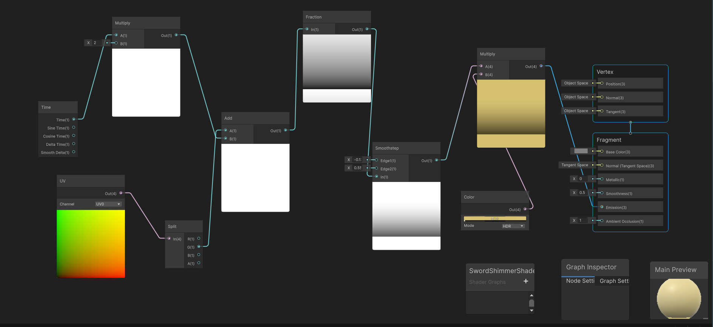
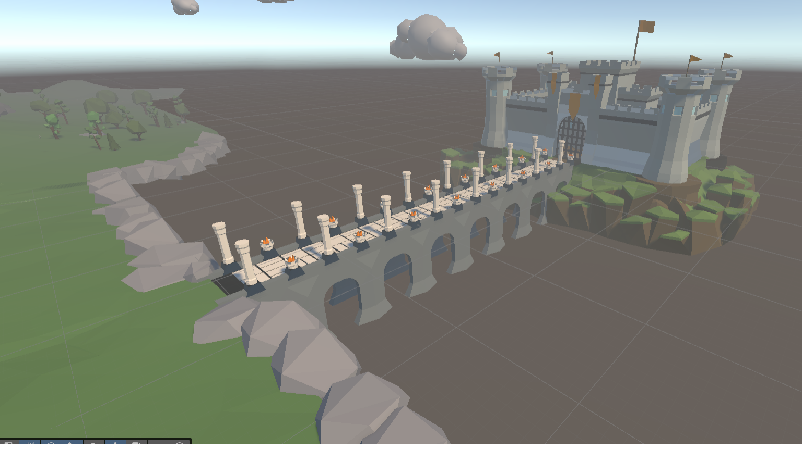
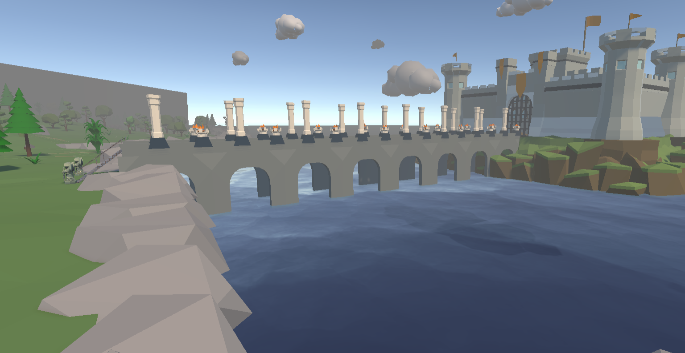

# Proyecto Unity - Trabajo Práctico

Este proyecto es parte de un trabajo práctico que tiene como objetivo integrar distintos conceptos de desarrollo en Unity, tales como iluminación, animaciones, optimización con LOD, perspectiva en primera persona y refactorización a VR.

---

## ✅ Objetivos del Trabajo

### 📋 Correcciones pedidas

**🏰Escena 1 (Dungeon)**

1. ✅ Poner techo en el dungeon
2. ✅ Corregir las arcadas
4. ✅ Agregado de la vista el primera persona en VR
5. ✅ Modificaciones de UI para VR
6. ✅ Adaptación de player a VR

 

---

### 🆕Nueva entrega
 

**🌄Nueva escena (Exterior)**
1. ✅ Iluminación baked y luces de tipo mixed y/o real time según el criterio para cada caso.
2. ✅ Punto de vista en Primera Persona.
3. ✅ Modificar objetos o agregar con LOD.
4. ✅ Incluir animación de objetos en loop. (Opcional: cambiar de animación según alguna interacción)
5. ✅ Agregado de materiales con  Shader Graph
6. ✅ Agregar agua con shader
7. ✅ Agregado de la vista el primera persona en VR

 

**🕶️ Refactorización a VR**
1. ✅ Instalación de los assets y paquetes necesarios
2. ✅ Configuración de inputs y controladores
3. ✅ Configuración de prefabs de  controladores
4. ✅ Configurar los objetos interactuables
5. ✅ Configurar teleport o movimiento libre si es necesario

---
---

## Progreso

### ✔️ [09/07/2025] Correcciones
Correcciones de alineado de paredes
COrrección de point lights

### ✔️ [24/06/2025] Refactorización de escena de Dungeon
- Cambio de camara y controles de movimiento del player
- Asignación de espada al control derecho.

- Enemigos reciben daño y se ve reflejado en su barra de vida (lo mismo pasa con el jugador)

### ✔️ [23/06/2025]Implementación de barrera mágica condicional
Se implementó un sistema de barrera mágica que impide el paso al jugador si no ha recolectado la espada. El flujo funciona así:

Pickup de Espada

Se configuró un objeto espada con un script (SwordPickup.cs) que define si el jugador tiene o no la espada (hasSword).

El jugador puede seleccionar la espada usando el ray interactor del control derecho (visualizado con el bloque ISDK_RayInteraction).

Trigger de la Barrera

Se colocó un TriggerZone frente a la barrera que activa la lógica del script MagicBarrierController.cs.

Este script verifica si el jugador tiene la espada:

Si no la tiene, muestra un mensaje indicando que el paso está bloqueado.

Si la tiene, la barrera se desvanece gradualmente usando interpolación de alpha en el material, y luego se desactiva el GameObject completo (barrierRoot), permitiendo el paso.

Jerarquía

Para evitar errores, se configuró la barrera como un GameObject padre (barrierRoot, por ejemplo statue_1_wall (1)) que contiene el trigger y los elementos visuales de la barrera.

Prevención de errores

Se validó en tiempo de ejecución que todos los componentes estén correctamente asignados, evitando NullReferenceException.

- Se creó shader para la barrera magica

- Se actualiza la pista cuando el player obtiene la espada

### ✔️ [22/06/2025] Avances en escenario exterior
- Armado de UI diegética, con cambios de mensaje según estado del juego
- Mensaje con pista de la misión a resovler controlado por el botón A del control Derecho para visualizar y ocultar.

- Las pistas son dinámicas en base a zonas con triggers

- Visualización de controles
- Al encontrar la espada se habilita el ray interactor en ella y al clickearla desaparece de su lugar de reposo
- Animacion en loop

### ✔️ [21/06/2025] Armado de escenario exterior
- Agregado de decoraciones con LODS
- Agregado del agua a la escena
- Seteo de límites del escenario
- Agregado de colliders para permitir el correcto desplazamiento en el mapa
- Shader y efectos de partículas que destacan a la espada a tomar

- Agregado de la camara VR y movimiento en la escena
- Modificación de rotación de la camara, no snap turn

## No Agua

### Agua

## ✔️ [17/06/2025] Correcciones pendientes

- Corrección es texturas de las arcadas
- Agregado de techo a calabozo
- Eliminado de la iluminación ambiente

### ✔️ [16/06/2025] Refactorización de Menú Inicial Parte 2

- Optimización de slider de Menú de Opciones para el correcto funcionamiento en VR
- Sonido ambiente de mení y click en botones
- Botons de inicio de jego y opciones funcionales
- Camara rota con controles pero no se permite el desplazamiento del juegador.
- Update del menu de control de volúmenes.
- Control de volumen en menu de configuración.

### ✔️ [15/06/2025] Refactorización de Menú Inicial

- Se refactorizó la escena de menú para ser completamente funcional en VR
- Se configuraron **luces mixtas (Mixed Point Lights)** colocadas en las velas del menú
- Se activaron sombras realtime en los objetos de la habitación y el personaje
- Se revisaron los componentes del All-in-One SDK v77 en Unity 6 para el raycast desde controladores
- Se solucionaron errores visuales por falta de configuración del Universal Render Pipeline (URP)
- Se realizaron múltiples pruebas de bake de iluminación en la escena, evaluando los tiempos de procesamiento
   
### ✔️ [14/06/2025] Refactorización de Menú Inicial

- Duplicado de prouyecto
- Instalación de paquete de Meta (A--In-One SDK)
- Prueba de funcionalidad

